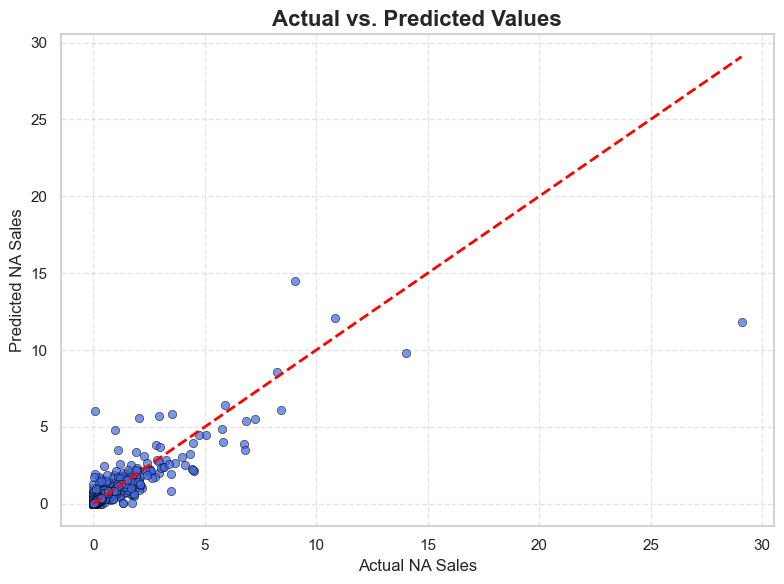

# 📊 Video Game Sales Analysis & Prediction

## 🎯 Objective

The goal of this project is to analyze historical video game sales data across multiple regions and build a predictive model for **North American sales (NA\_Sales)** based on game metadata such as genre, platform, release year, and sales in other regions.

---

### Dataset description
**Source:** [kaggle - Video Game Sales](https://www.kaggle.com/datasets/anandshaw2001/video-game-sales)

This dataset contains sales data for video games across platforms, genres and regions.

**Sub-dataset information:**.
- Number of rows: 16598
- Number of columns: 11

**Columns:**.

- **Rank** - Ranking of total sales.
- **Name** - Name of the game.
- **Platform** - Platform on which the game was released (e.g. PC, PS4).
- **Year** - Year the game was released
- **Genre** - Genre of the game
- **Publisher** - Publisher of the game
- **NA_Sales** - Sales in North America (in millions).
- **EU_Sales** - Sales in Europe (in millions)
- **JP_Sales** - Sales in Japan (in millions)
- **Other_Sales** - Sales in the rest of the world (in millions)
- **Global_Sales** - Total sales worldwide (in millions)

---
## 🧹 1. Data Cleaning & Preparation

The dataset initially included missing values in key columns such as `Year` and `Publisher`. The following steps were taken to clean the data:


* **Missing Value Handling**:

  * Imputed missing `Year` values with the average release year across platforms for the same title.
  * Imputed missing `Publisher` values with the  highest publisher count across platforms for the same title.
  * Dropped remaining rows with nulls post-imputation.

* **Data Validation**:

  * Removed incomplete data for `Year` above 2016
  * Checked for negative values in numerical columns (none were found).
  * Duplicates were removed from the dataset.

* **Type Casting**:

  * Converted the `Year` column to `IntegerType` for consistency.

* **Identified outliers using IQR**:
    * It turned out that these are games that have achieved significant sales well-known by everyone.

Full cleaning pipeline:
<details>
<summary>Show</summary> 

```python
from pyspark.ml import Transformer
from pyspark.sql.functions import (
    col, when, log1p, round as spark_round, desc,
    count, avg, row_number, coalesce
)
from pyspark.sql.types import NumericType
from pyspark.sql import DataFrame, Window

class Preprocessing(Transformer):
    def _transform(self, df: DataFrame) -> DataFrame:

        df = df.na.replace("N/A", None)

        df = df.dropDuplicates()

        if "Year" in df.columns:
            df = df.withColumn("Year", col("Year").cast("integer"))

        avg_year_df = df.filter(col("Year").isNotNull()) \
            .groupBy("Name") \
            .agg(spark_round(avg("Year")).cast("int").alias("Avg_Year"))

        pub_window = Window.partitionBy("Name", "Publisher")
        pub_counts = df.filter(col("Publisher").isNotNull()) \
            .withColumn("pub_count", count("*").over(pub_window))

        ranked_publishers = pub_counts \
            .withColumn("rank", row_number().over(Window.partitionBy("Name").orderBy(desc("pub_count")))) \
            .filter(col("rank") == 1) \
            .select("Name", col("Publisher").alias("Most_Common_Publisher"))

        fill_df = avg_year_df.join(ranked_publishers, on="Name", how="outer")
        df = df.join(fill_df, on="Name", how="left")

        df = df.withColumn("Year", coalesce(col("Year"), col("Avg_Year"))) \
               .withColumn("Publisher", coalesce(col("Publisher"), col("Most_Common_Publisher"))) \
               .drop("Avg_Year", "Most_Common_Publisher")

        df = df.filter(~col("Year").isin([2017, 2020]))

        df = df.na.drop()

        sales_columns = ['NA_Sales', 'EU_Sales', 'JP_Sales', 'Other_Sales', 'Global_Sales']
        for col_name in sales_columns:
            if col_name in df.columns:
                df = df.withColumn(f'{col_name}_log', log1p(col(col_name)))


        df = df.withColumn("Is_Japan_Hit", when(col("JP_Sales") > 1.0, 1).otherwise(0))

        return df

```

</details> 

---

## 📈 2. Exploratory Data Analysis (EDA)

### 📊 Global Sales Distribution

- All sales data are strongly right-skewed - most games sell poorly, and only a few reach very high numbers.

- This is confirmed by log-transformed sales distributions - low averages, low maxes.

- Low sales of most games - confirms the Pareto principle: 20% of games generate 80% of sales.


### 🔹 Sales Over Time Analysis


* **North America** is the clear leader, with roughly **4,300 million units** sold—about twice Europe’s volume.
* **Europe** comes in second (\~2,400 M), followed by **Japan** (\~1,300 M) and **Other regions** (\~800 M).
* Together, NA + EU account for **almost 75%** of all physical game sales, underscoring their critical importance to publishers.


* From **1980 to the mid-’90s**, sales climbed steadily.
* A massive boom hit **2000–2008**, with a peak of **≈689 M units** in 2008—driven by PS2, Wii, Xbox 360, and broader console adoption.
* After 2008, global retail sales **declined steadily**, likely reflecting market saturation and the shift toward digital distribution.


* **Game releases** rose from \~15 titles/year in the early ’80s to **over 1,000** by 2008, then fell back below 400 by 2016.
* **“Hits”** (titles selling >1 M units) climbed from single digits in the ’80s to about **150** in 2008, then declined to \~20 by 2016.
* The **hit-rate** (Hits / Total Games) peaked around **14–15%** in the late 2000s—despite the flood of new releases, only a small fraction became true blockbusters.


### 🔹 Genre & Platform Insights


* **Action games** reign supreme, with over **1.7 billion units** sold worldwide.
* **Sports** titles come in second (\~1.3 B), followed by **Shooters** (\~1.0 B) and **RPGs** (\~0.9 B).
* The “long tail” of niche genres (Puzzle, Adventure, Strategy) each account for **<250 M** units.
* Investing in blockbuster Action, Sports or Shooter franchises yields the biggest returns, while smaller genres may require lower development costs or targeted audiences to be profitable.


* **PS2** leads all platforms with **\~1.25 B** units sold, followed by **Xbox 360 (\~970 M)**, **PS3 (\~950 M)**, **Wii (\~920 M)** and **DS (\~820 M)**.
* There’s a sharp drop-off after the top 6 consoles—PC, PS4, XB and GB each sit in the 250–305 M range.
* The massive install bases of PS2, 360, PS3 and Wii drove the largest software markets. PC and newer consoles (PS4, Switch) still matter but haven’t matched that mid-2000s peak.


* The **DS**, **PS2**, and **Wii** also had the most games released.
* The **PS2** and **DS** each hosted **\~2,100** game releases—the largest libraries of all time. PS3 (\~1,320), Wii (\~1,300) and X360 (\~1,250) follow.
* Platforms with fewer titles (e.g., Saturn, Dreamcast, 3DO) unsurprisingly generated much less total revenue.
* **Insight:** A big game library amplifies a platform’s long-tail revenue, but sheer quantity doesn’t guarantee per-game success (see next point).

### 🔹 Publisher Performance


* **Electronic Arts** has released the most titles (\~1,350), way ahead of **Activision (\~980)**, **Namco Bandai (\~930)** and **Ubisoft (\~910)**.
* Legacy platform holders (Nintendo \~700, Sony \~680, Sega \~640) also feature in the top ten, but with smaller portfolios than the big third-party publishers.

---


## 🔍 4. Correlation Analysis


* North America and Europe are dominant contributors to global sales.
* Japan behaves differently and often doesn’t align with Western markets.
* Year has weak correlation, suggesting limited temporal effect on sales.

---

## 🤖 5. Predictive Modeling

Two models are developed:

- **Linear Regression**

    | Metric         | Train Set | Test Set |
    |----------------|-----------|----------|
    | **MAE**        | 0.1651    | 0.1866   |
    | **MSE**        | 0.2093    | 0.3381   |
    | **RMSE**       | 0.4575    | 0.5814   |
    | **R² Score**   | 0.6849    | 0.5232   |

    - **Target Mean**: The mean of the target variable is **0.2656**, providing a valuable reference for evaluating absolute errors.
    
    - **Mean Absolute Error (MAE)**:
        - The **Test MAE** of **0.1866** means the model's average error is roughly **70% of the target mean** — reasonably accurate but leaves room for refinement.

    - **Root Mean Squared Error (RMSE)**:
        - With an RMSE of **0.5814**, the model's average prediction deviates more than **twice the mean of the target**, indicating moderate error magnitude.

    - **R² Score**:
        - **Train R² = 0.6849**: The model explains 68% of the variance on training data.
        - **Test R² = 0.5232**: The drop on test data is expected but still indicates the model captures over half of the variation.


- **Random Forest Regressor**
    - Hyperparameter tuning using GridSearchCV.
    - Exporting the model using `joblib` for production use.

        | Metric         | Train Set | Test Set  |
        |----------------|-----------|-----------|
        | **MAE**        | 0.0434    | 0.0857    |
        | **MSE**        | 0.0824    | 0.1803    |
        | **RMSE**       | 0.2871    | 0.4246    |
        | **R² Score**   | 0.8759    | 0.7457    |


        - **MAE** (Test): The average prediction is off by only **0.0857**, which is just **~32% of the target mean (0.2656)** — very strong accuracy.
        - **MSE/RMSE**: RMSE of **0.4246** confirms low variance in prediction error. This is a significant improvement from earlier models.
        - **R² Score**:
            - **Train R² = 0.8759**: Model captures ~88% of variance in training data.
            - **Test R² = 0.7457**: Maintains strong generalization on unseen data, with minimal overfitting.


        
---


## ✅ Conclusion

The Random Forest model provides robust, high-quality predictions with minimal overfitting. It substantially outperforms the baseline and earlier iterations, making it well-suited for deployment or further optimization.

---

## ⚠️ Limitations

* Dataset only goes up to 2020 and excludes **digital/download sales**.
* No pricing, revenue, or cost data—limits financial insight.
* Some genre/platform data may be inconsistently labeled (e.g., sequels, remakes).
* Causal inference is not supported — only correlation and prediction.

---
